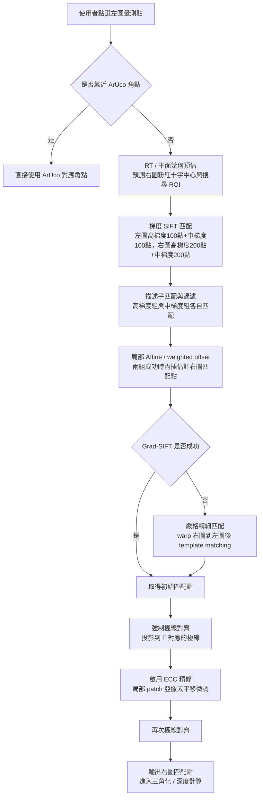
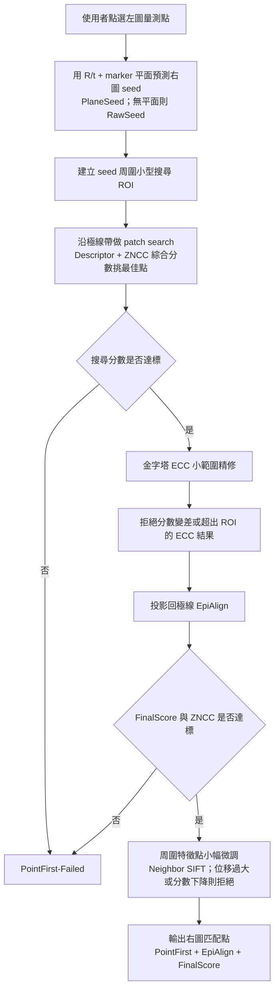

# v1 / v2 匹配流程投影片稿

## v1 舊流程：Grad-SIFT + Precise + EpiAlign + ECC

優勢：
- 特徵點多，能利用局部鄰域的多個梯度點推估 Homography / Affine，對有紋理區域很有彈性。
- 也會先用 RT / marker 平面預估右圖搜尋中心，也就是畫面上的粉紅十字中心，能縮小右圖候選範圍。
- 有 Precise template matching 作為補救，Grad-SIFT 找不到時仍可能成功。
- 強制極線對齊與 ECC 可降低垂直極線誤差，讓深度計算更穩。
- 可視化 Grad-SIFT 連線，方便 debug 匹配來源。

缺點：
- 流程較長，參數與開關多，失敗原因較難一眼判斷。
- 依賴局部高梯度與足夠特徵，低紋理、反光、重複紋理處容易飄。
- 先找一批鄰近特徵再推回使用者點，可能不是「該點本身」的最佳對應。
- ECC 若起始點不佳，可能被局部相似 patch 拉偏，所以需要再做極線修正。

## v2 新流程：Point First

優勢：
- 以使用者點為核心，先預測該點在右圖的幾何落點，比 v1 更像「point-to-point」匹配。
- 搜尋範圍被 seed ROI 與極線帶限制，較不容易被遠處相似紋理吸走。
- 內建分數、ZNCC、ROI 檢查與 ECC rejection，失敗會明確回報原因。
- 最後可用周圍 SIFT 特徵點做小幅座標微調，但若修正過大、超出 ROI 或分數變差會保留原 Point First 結果。
- 少依賴大量局部特徵點，對局部特徵不足的點位較友善。

缺點：
- 更依賴相機外參、Fundamental Matrix、marker 平面或平面假設；幾何不準時 seed 會偏。
- 若真實表面明顯偏離 marker 平面，Homography seed 可能把搜尋中心帶錯。
- 小 ROI 提高穩定性，但也可能漏掉大位移或姿態估計錯誤造成的真實對應點。
- 若 patch 本身低紋理或反光嚴重，FinalScore / ZNCC 可能直接拒絕，成功率取決於局部影像品質。
