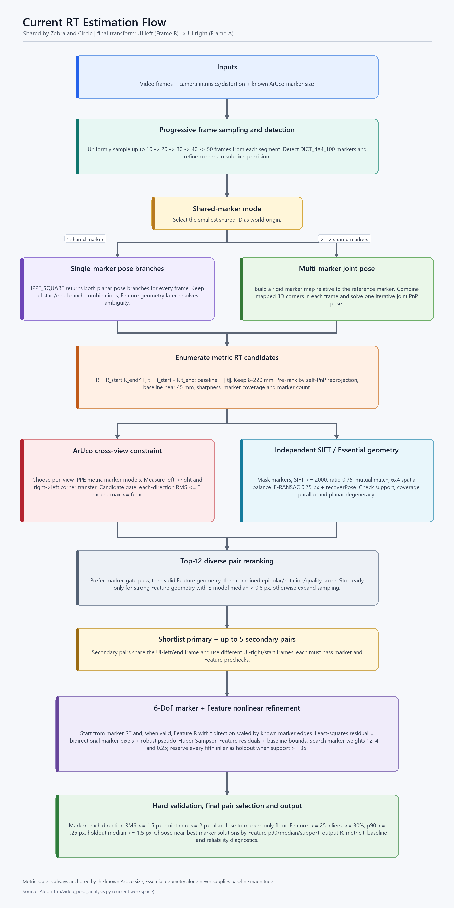

# Zebra / Circle 目前 RT 計算流程

## 適用範圍

- `depth_measure_multi_aruco_sbs_camera_v7_demo_zebra.py` 與 `depth_measure_multi_aruco_sbs_camera_v7_demo_zebra_circle.py` 都把 RT 選幀與估計工作交給 `Algorithm/video_pose_analysis.py`。
- 兩支 UI 程式只在呼叫前同步 baseline 範圍、理想 baseline、配對評分權重與前處理函式，因此核心 RT 演算法相同。
- UI 左圖是影片結尾段選出的 Frame B，UI 右圖是影片開頭段選出的 Frame A。
- 最終外參定義為左圖到右圖：`X_right = R_rel @ X_left + t_rel`，而 `baseline = ||t_rel||`，單位為 mm。



## 1. 漸進式抽樣與 ArUco 偵測

1. 載入整段影片，依設定把候選範圍分成開頭段與結尾段。
2. 依序以每段最多 `10, 20, 30, 40, 50` 張影格做均勻抽樣；若較小樣本已找到強候選就提前停止，否則擴大搜尋。
3. 每張影格先做灰階前處理，再偵測 `DICT_4X4_100` ArUco，並以 `cornerSubPix` 精修四個角點。
4. 找出開頭段與結尾段共同出現的 marker ID，取最小 ID 作為 `ref_id` 與世界座標原點。沒有共享 marker 時該階段無法建立統一座標系。

## 2. 一個與多個 ArUco 的初始姿態分支

### 只有一個共享 marker

- 每張影格對 `ref_id` 使用 `SOLVEPNP_IPPE_SQUARE`，保留平面標記可能產生的兩個 pose 分支。
- 每個開頭影格與結尾影格的所有 IPPE 分支組合都會展開成 RT 候選。
- 單一 marker 的同影像 PnP 擬合誤差通常無法區分鏡像分支，因此後續主要由 Feature 幾何與雙向 marker transfer 協助消歧。

### 至少兩個共享 marker

- 先從所有同時看見 `ref_id` 與其他 marker 的影格，估計其他 marker 相對於 `ref_id` 的剛體姿態。
- 多次觀測的旋轉以 SVD 平均，平移直接平均，建立 `marker_map`。
- 對每張候選影格，把所有可用 marker 的已知 3D 角點合併後執行 iterative PnP，得到單一 joint pose。
- 這裡不要求 marker 共面；前提是 marker 在拍攝期間彼此固定，且 `marker_map` 能從共視影格可靠建立。

## 3. 建立影格對與初始 ArUco RT

對每個開頭影格 `s` 與結尾影格 `e`：

```text
R_rel = R_s @ R_e.T
t_rel = t_s - R_rel @ t_e
baseline = norm(t_rel)
```

- 只保留 baseline 位於 `8` 至 `220 mm` 的候選。
- 初步配對分數包含：同影像 marker PnP 重投影誤差、baseline 偏離理想值 `45 mm`、模糊程度、marker 畫面覆蓋率、共享 marker 數量。
- 這個初步重投影誤差是各影格內部的 PnP/map 擬合誤差，不是最後使用的左右圖雙向投影硬門檻。

## 4. SIFT 對應與 Essential 幾何

每個進入前段排名的影格對會執行以下流程：

1. ArUco 區域連同外擴 `8 px` 被遮罩，避免 marker 自身紋理主導獨立 Feature 驗證。
2. 每張影像最多偵測 `2000` 個 SIFT keypoints，`contrastThreshold=0.01`。
3. 左到右做 KNN `k=2`，套用 Lowe ratio test `0.75`。
4. 右到左做 1-NN，只保留 mutual best match。
5. 使用 `6 x 4` 網格平衡特徵；左右任一格最多保留 `24` 組，總數最多 `500` 組。
6. 至少 `25` 組候選時，以 `findEssentialMat` 的 RANSAC 求 E，閾值 `0.75 px`，再用 `recoverPose` 選擇正深度內點最多的 E 分支。
7. Feature 幾何要同時滿足：內點至少 `25`、內點率至少 `30%`、grid coverage 至少 `17%`、convex-hull coverage 至少 `2%`、中位視差角至少 `0.05 deg`。
8. 若 Homography 支持率很高且視差太低，會被判定為平面/低視差退化，不允許 Feature 參與 RT 精修。

Essential Matrix 只能得到旋轉 `R_E` 與平移方向 `t_E`。目前程式以共享 ArUco 的已知實體邊長恢復 Feature 解的尺度：先假設 `||t_E||=1` 三角化 marker 四角，再以 `marker_size_mm / 三角化邊長` 得到 metric baseline。多 marker 的尺度若相對 MAD 過大則拒絕。

## 5. Top-K 幾何重排與漸進式停止

- 初步分數較好的候選中，最多選 `12` 個不同影格對進行完整 SIFT 驗證。
- 為避免相鄰影格壟斷名額，同一開頭影格最多 `2` 對，同一結尾影格最多 `4` 對；單 marker 時，同一影格對的所有 IPPE 組合都保留。
- 每個候選計算兩類幾何品質：
  - ArUco：左右雙向 marker transfer RMS 與最大角點誤差；候選階段上限為 RMS `3 px`、單點最大 `6 px`。
  - Feature：候選 RT 下的對稱極線距離、Feature 自己的 E-model 極線誤差、E 與 ArUco 旋轉差、內點與空間覆蓋品質。
- 排序時先優先通過 marker candidate gate，再優先 Feature geometry 合格，最後比較 combined score。
- 階段提前停止條件是 marker candidate 合格、Feature 達到 strong 等級，且 Feature 自己的 E-model 中位極線誤差低於 `0.8 px`。注意這個停止值不是最終 RT 下的 Feature p90。
- 到每段 `50` 張仍沒有 strong 候選時，會在已驗證候選中降級選擇目前最好的一組。

## 6. ArUco 雙向 transfer 模型

對每個共享 marker，程式會在左右影像各自執行 IPPE，並依目前 RT 選擇較一致且所有角點位於相機前方的分支：

- 左圖來源的 metric 3D marker corners 經候選 RT 投影到右圖，形成 left-to-right 殘差。
- 右圖來源的 metric 3D marker corners 經反 RT 投影到左圖，形成 right-to-left 殘差。
- 兩個方向的所有角點共同形成 marker residual vector。

因此目前的 marker 約束不是單純比較同一張影像內的 PnP 擬合誤差，而是要求候選 RT 能跨左右視角搬移已知尺寸的 marker 幾何。左右來源的 3D marker 模型是由各自影像的 IPPE 分支建立，並在單次 nonlinear optimization 中固定。

## 7. Marker + Feature 聯合 RT 精修

每個最佳或次佳影格對都會建立多組初始解：

1. 從 ArUco 初始 RT 做 marker-only nonlinear refinement。
2. 從 marker 解出發，分別以 marker group weight `12, 4, 1, 0.25` 做 Marker + Feature refinement。
3. Feature geometry 合格且成功恢復 metric baseline 時，再從 `R_E, scaled t_E` 出發建立另一批 marker-only 與 Marker + Feature 候選。

最佳化變數是 Rodrigues rotation 三參數與 translation 三參數，共 6 DoF。`scipy.optimize.least_squares` 的 residual 包含：

- ArUco 左到右與右到左的 pixel transfer residual。
- Essential/recoverPose 內點的 signed Sampson residual。
- Feature residual 使用 pseudo-Huber robustification，使少數錯誤 match 的影響飽和。
- baseline 超出 `8` 至 `220 mm` 時的軟懲罰。

若 recoverPose 內點至少 `35` 個，每五個取一個作為 holdout，不參與最佳化，只用來檢查 RT 是否泛化；其餘內點才是真正參與 joint optimization 的 UI SIFT 點。

## 8. 單一影格對內的最終驗收

候選必須通過動態 marker gate：

- marker combined RMS 上限為 `min(1.5 px, marker-only floor RMS + 0.75 px)`。
- 左到右 RMS 與右到左 RMS 都不得超過 `1.5 px`。
- 最大角點誤差上限為 `min(2.0 px, marker-only floor max + 1.5 px)`。

Feature 最終驗收條件：

- 原始 Feature geometry 必須為 `quality_ok`。
- 最終極線內點至少 `25`，且至少占平衡後候選的 `30%`。
- 最終內點的 epipolar p90 不超過 `1.25 px`。
- 有 holdout 時，holdout median 不超過 `1.5 px`。

若有多個同時通過 Marker 與 Feature 的解，先保留 marker RMS 距離最佳值 `0.05 px` 內的候選，再依 Feature seed p90、seed median、內點數量與 marker RMS 排序。若沒有 Feature 合格解但有 marker 合格解，會選 marker-only；若 marker gate 也全失敗，仍回傳 marker RMS 最小者，但標記為不可靠。

## 9. 最佳圖與次佳圖的最終比較

- 初步最佳對之外，最多保留 `5` 組次佳對；它們固定使用同一張 UI 左圖/結尾影格，搭配不同 UI 右圖/開頭影格。
- 次佳對必須先通過 marker candidate gate、Feature geometry，以及 E-model 極線誤差 `< 1.5 px`，之後也要獨立執行完整 joint refinement。
- 最終候選池只收 Marker 與 Feature 都通過者。
- 先取 marker RMS 距離全池最佳值 `0.25 px` 內的影格對，再依 Feature final p90、median、內點數與 marker RMS 排序；次佳對若更好，可以升格為主影格對。

## 10. 輸出與可靠度

- 輸出完整 metric `R_rel`、`t_rel` 與 `baseline=||t_rel||`，方向為 UI 左圖到 UI 右圖。
- `rt_sift_applied=True` 只表示最後選中的解確實由 joint Feature residual 推動；若最後選 marker-only，Feature 仍可能只扮演驗證角色。
- `rt_reliable=True` 需要最終 marker 雙向驗收、最終 Feature 驗收及前段 Feature geometry quality 全部通過。
- 診斷檔保存每層匹配數、Essential/recoverPose/optimization/holdout/final inlier mask、每點最終極線誤差，以及最終 RT 與 marker 雙向誤差。

