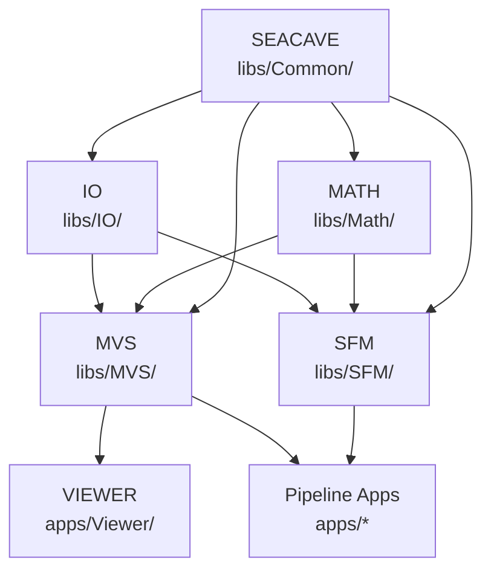
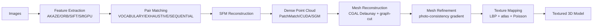
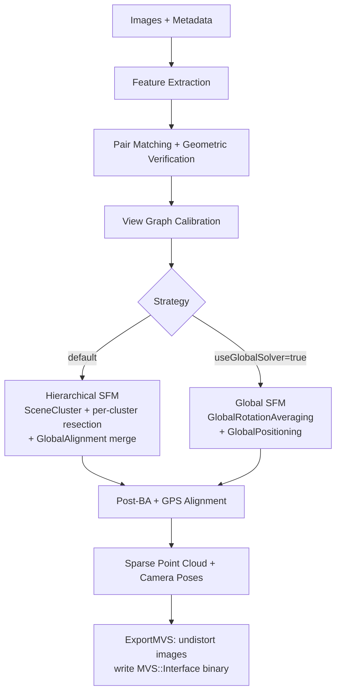
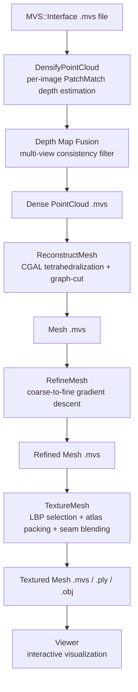
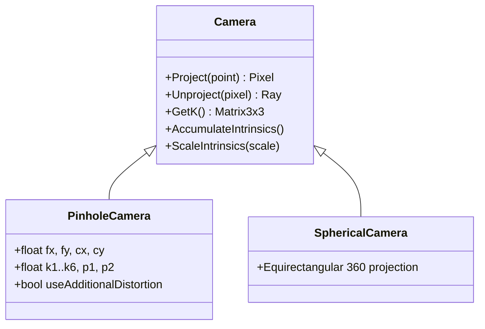

# OpenMVS Architecture Overview

> Auto-generated by codebase analysis. Last updated: 2026-03-24

OpenMVS is a comprehensive C++ photogrammetry library that implements a complete pipeline from image sequences to textured 3D models. It includes Structure-from-Motion (SFM) for camera pose estimation and sparse reconstruction, and Multi-View Stereo (MVS) for dense reconstruction, mesh generation, and texture mapping. See [Pipeline Documentation](pipelines.md) for pipeline data flows and [Feature Catalog](features_catalog.md) for module details.

---

## Table of Contents

1. [System Overview](#system-overview)
2. [Namespace Organization](#namespace-organization)
3. [Library Structure](#library-structure)
4. [Application Layer](#application-layer)
5. [End-to-End Pipeline Overview](#end-to-end-pipeline-overview)
6. [Key Data Structures](#key-data-structures)
7. [Build System](#build-system)
8. [External Dependencies](#external-dependencies)
9. [GPU Acceleration](#gpu-acceleration)
10. [Threading Model](#threading-model)
11. [File Formats](#file-formats)
12. [Memory Management](#memory-management)

---

## System Overview

OpenMVS converts a set of photographs into a textured 3D model through a staged pipeline:

1. **SFM Stage:** Extract features → match pairs → estimate camera poses → sparse 3D reconstruction
2. **MVS Stage:** Dense depth estimation → point cloud fusion → mesh reconstruction → mesh refinement → texture mapping

The two stages share data via `MVS::Interface` — a binary format that carries calibrated camera poses, intrinsics, and sparse 3D points from SFM into the MVS pipeline.

---

## Namespace Organization

| Namespace | Location | Description |
|-----------|----------|-------------|
| `SFM` | `libs/SFM/` (~30 headers) | Structure-from-Motion reconstruction algorithms |
| `MVS` | `libs/MVS/` (~20 headers) | Multi-View Stereo reconstruction algorithms |
| `SEACAVE` | `libs/Common/` (~40 headers) | Low-level framework utilities |
| `VIEWER` | `apps/Viewer/` | Interactive 3D visualization |
| `IO` | `libs/IO/` (~15 headers) | File format I/O subsystem |
| `MATH` | `libs/Math/` (~10 headers) | Mathematical algorithms |

### Namespace Dependency Diagram



---

## Library Structure

### `libs/Common/` — SEACAVE Framework

Foundation layer for all OpenMVS code. Every library depends on it via the precompiled header `Common.h`.

Key components:
- **Containers:** `cList<T>` (custom vector, ~40 header+inline files total)
- **Geometry primitives:** AABB, OBB, Ray, Plane, Sphere, Line, Quaternion (Eigen3-based)
- **Spatial data structures:** `TOctree`, `TOctreeLOD`
- **Threading:** `BS::light_thread_pool`, `Thread`, `CriticalSection`, `RWLock`, `EventQueue`
- **Memory:** `CSharedPtr<T>` (ref-counted), `CAutoPtr<T>` (unique)
- **Utilities:** `String`, `File`, `Random`, `MemFile`, `HalfFloat`, `RunningAverage`
- **CUDA helpers:** `UtilCUDA`, `UtilCUDADevice`
- **Config system:** `DEFVAR_*` macros for runtime parameter binding

File count: ~40 `.h`/`.inl` files

### `libs/IO/` — File Format I/O

Handles 3D geometry formats and image formats.

Key components:
- **PLY:** Full-featured polygon format (ASCII + binary LE/BE)
- **OBJ:** Wavefront OBJ with MTL material libraries
- **glTF:** Binary/ASCII 3D format via `tiny_gltf.h` (header-only)
- **Image formats:** BMP, TGA, DDS (always available); PNG, JPEG, TIFF, JpegXL (conditional on build flags); SCI (custom)
- **Third-party:** `json.hpp` (nlohmann JSON), `TinyXML2` (XML)

File count: ~20 `.h`/`.cpp` files

### `libs/Math/` — Mathematical Algorithms

Photogrammetry-specific math beyond Eigen3.

Key components:
- **Robust norms:** M-estimators (Huber, Cauchy, Geman-McClure, Tukey, etc.)
- **Disjoint set:** Union-find for track building and connectivity analysis
- **Similarity transform:** 7-DOF Sim(3), Umeyama estimation, rotation alignment
- **Geodetic transforms:** WGS84 ↔ ECEF ↔ ENU for GPS
- **Optimization:** ADMM L1 solver, Levenberg-Marquardt (LMFit)
- **Graph algorithms:** IBFS max-flow/min-cut, Loopy Belief Propagation

File count: ~10 `.h`/`.cpp` files (plus `IBFS/` and `LMFit/` subdirectories)

### `libs/SFM/` — Structure-from-Motion

Full SFM pipeline implementation supporting three reconstruction strategies.

Key components: Feature extraction, pair matching, VocabularyTree image retrieval, geometric verification, track building, star initialization, incremental resection, bundle adjustment, global rotation/scale/translation averaging, scene clustering, global alignment, keyframe extraction, COLMAP/ROMA2 import, MVS export.

File count: ~30 `.h`/`.cpp` files

### `libs/MVS/` — Multi-View Stereo

Full MVS pipeline from sparse SFM output to textured mesh.

Key components: Dense depth estimation (CPU PatchMatch + CUDA PatchMatchCUDA + SGM), depth fusion (multi-view consistency), CGAL mesh reconstruction, mesh refinement (CPU + CUDA), texture mapping (LBP face selection + atlas packing + seam leveling), quality assessment, DMapCache disk caching.

File count: ~20 `.h`/`.cpp`/`.cu` files (plus `CUDA/` subdirectory)

---

## Application Layer

| App | Stage | Entry Function | Purpose |
|-----|-------|---------------|---------|
| `CreateStructure` | SFM | `SFM::Scene::Reconstruct()` | Full SFM pipeline |
| `DensifyPointCloud` | MVS | `MVS::Scene::DenseReconstruction()` | Dense depth estimation + fusion |
| `ReconstructMesh` | MVS | `MVS::Scene::ReconstructMesh()` | Surface reconstruction from points |
| `RefineMesh` | MVS | `MVS::Scene::RefineMesh()` | Mesh quality improvement |
| `TextureMesh` | MVS | `MVS::Scene::TextureMesh()` | Texture atlas mapping |
| `ExtractKeyframes` | Utility | `SFM::KeyframeExtractor::ExtractFromVideo()` | Video to keyframe set |
| `TransformScene` | Utility | `MVS::Scene::Transform()` | Apply geometric transforms |
| `Viewer` | Visualization | `VIEWER::Scene::Run()` | Interactive 3D view |
| `Tests` | Testing | Google Test / custom | SFM/MVS test suite |
| `InterfaceCOLMAP` | Import/Export | `ImportScene()` / `ExportScene()` | COLMAP format bridge |
| `InterfaceOpenMVG` | Import | `ImportScene()` | OpenMVG format bridge |
| `InterfaceMetashape` | Import | `ImportScene()` | Metashape XML bridge |
| `InterfaceMVSNet` | Import | `ImportScene()` | MVSNet format bridge |
| `InterfacePolycam` | Import | `ImportScene()` | Polycam format bridge |

---

## End-to-End Pipeline Overview

### High-Level Flow



### SFM Strategy Options



### MVS Stage Detail



---

## Key Data Structures

### SFM::Scene

Central container for the SFM stage. Defined in `libs/SFM/Scene.h`.

| Field | Type | Description |
|-------|------|-------------|
| `cameras` | `CameraPtrArr` | Shared polymorphic camera objects (`PinholeCamera` or `SphericalCamera`) |
| `images` | `ImageArr` | Per-image features, descriptors, pose (R, C), EXIF metadata |
| `pairs` | `ImagePairArr` | Pairwise matches, E/F/H matrices, relative pose, composite weights |
| `tracks` | `TrackArr` | 3D points with `Observation[]` arrays (imageID, featureID) |
| `colors` | `Pixel8UArr` | Per-track RGB colors (optional) |
| `transform` | `Matrix4x4` | GPS similarity transform (identity if no GPS) |
| `status` | `Status` | Pipeline state flags |
| `threadPool` | `BS::light_thread_pool` | Worker thread pool |

### SFM Camera Hierarchy



### MVS::Scene

Central container for the MVS stage. Defined in `libs/MVS/Scene.h`.

| Field | Type | Description |
|-------|------|-------------|
| `platforms` | `PlatformArr` | Camera rigs with mounted cameras and pose trajectories |
| `images` | `ImageArr` | Per-image: camera (K, R, C), lazy pixels, scored neighbor views |
| `pointcloud` | `PointCloud` | 3D points with per-point views, weights, normals, colors, octree |
| `mesh` | `Mesh` | Vertices, faces, normals, UV coordinates, texture atlases |
| `obb` | `OBB3f` | Optional region-of-interest oriented bounding box |
| `transform` | `Matrix4x4` | Optional coordinate system transform |
| `nCalibratedImages` | `unsigned` | Count of valid calibrated images |
| `nMaxThreads` | `unsigned` | Thread limit (0 = hardware maximum) |

### MVS Camera Model

Two-tier flat model (no polymorphism, no distortion — distortion removed in SFM's `ExportMVS()`):

- `CameraIntern`: `K` (3×3 intrinsic matrix), `R` (3×3 world-to-camera rotation), `C` (3×1 camera center in world)
- `Camera` extends `CameraIntern`: adds cached `P` (3×4 projection matrix)
- Convention: `P = K[R|t]` where `t = -RC`; pixel center at (0,0)

### PointCloud

Defined in `libs/MVS/PointCloud.h`.

| Field | Type | Description |
|-------|------|-------------|
| `points` | `PointArr` | 3D positions |
| `pointViews` | `PointViewArr` | Which images see each point |
| `pointWeights` | `PointWeightArr` | Per-view confidence weights |
| `normals` | `NormalArr` | Surface normals (optional) |
| `colors` | `ColorArr` | RGB colors (optional) |
| `labels` | `LabelArr` | Semantic labels (optional) |

Includes nanoflann KD-tree (K=16 neighbors) for normal estimation, and octree for spatial queries.

### Mesh

Defined in `libs/MVS/Mesh.h`.

| Field | Type | Description |
|-------|------|-------------|
| `vertices` | `VertexArr` | 3D vertex positions |
| `faces` | `FaceArr` | Triangle indices (3 vertex IDs) |
| `vertexNormals`, `faceNormals` | `NormalArr` | Computed normals |
| `vertexVertices` | `VertexVerticesArr` | Vertex adjacency list |
| `vertexFaces` | `VertexFacesArr` | Incident face list per vertex |
| `faceFaces` | `FaceFacesArr` | Face adjacency list |
| `faceTexcoords` | `TexCoordArr` | Per-face UV coordinates |
| `texturesDiffuse` | `Image8U3Arr` | Texture atlas images |

### DepthData

Defined in `libs/MVS/DepthMap.h`. Per-image container for depth estimation.

| Field | Type | Description |
|-------|------|-------------|
| `images` | `ViewDataArr` | Reference + neighbor warped images |
| `depthMap` | `DepthMap` | Per-pixel depth (float) |
| `normalMap` | `NormalMap` | Per-pixel surface normal |
| `confMap` | `ConfidenceMap` | ZNCC confidence per pixel |
| `dMin`, `dMax` | `float` | Depth range from sparse SFM points |

---

## Build System

### CMake + vcpkg

```
openMVS/
├── CMakeLists.txt          — root: version, options, subdirectories
├── vcpkg.json              — vcpkg manifest: all external dependencies
├── build/
│   └── Utils.cmake         — custom CMake utilities and macros
├── libs/
│   ├── Common/CMakeLists.txt
│   ├── IO/CMakeLists.txt
│   ├── Math/CMakeLists.txt
│   ├── SFM/CMakeLists.txt
│   └── MVS/CMakeLists.txt
└── apps/
    └── */CMakeLists.txt    — one per application
```

**Build commands:**

```bash
mkdir make && cd make
cmake ..                    # configure (vcpkg auto-installs deps)
cmake --build . -j4         # build (or: ninja)
```

Executables land in `make/bin/Debug/` or `make/bin/Release/`.

### Generated Configuration

`ConfigLocal.h` is auto-generated at configure time and included by every translation unit via `Common.h`. It contains:

- CMake-detected build flags (`OpenMVS_USE_CUDA`, `OpenMVS_USE_CERES`, etc.)
- Platform identification macros
- Git commit information

### Feature Flags

| Flag | Description | Default |
|------|-------------|---------|
| `OpenMVS_USE_CUDA` | Enable CUDA GPU acceleration | Off (requires CUDA Toolkit) |
| `OpenMVS_USE_CERES` | Enable Ceres Solver for BA | On |
| `OpenMVS_USE_SIFTGPU` | Enable SiftGPU feature extraction | Off |
| `OpenMVS_USE_OPENMP` | Enable OpenMP parallelism | On |
| `_USE_PNG` | Enable PNG image format | On (libpng) |
| `_USE_JPG` | Enable JPEG image format | On (libjpeg) |
| `_USE_TIFF` | Enable TIFF image format | On (libtiff) |
| `_USE_JXL` | Enable JPEG XL format | Optional (libjxl) |
| `_USE_SUITESPARSE` | Enable SuiteSparse CHOLMOD | Optional |

---

## External Dependencies

| Library | Version | Purpose | Used By |
|---------|---------|---------|---------|
| Eigen3 | 3.4+ | Linear algebra (matrices, vectors, decompositions) | Common, SFM, MVS |
| OpenCV | 4.x | Image I/O, feature detection (AKAZE, ORB, SIFT), optical flow | Common, SFM, MVS |
| Boost | 1.75+ | Serialization (`.mvs` format), program options, filesystem | MVS, all apps |
| CGAL | 5.x | Delaunay tetrahedralization, min-cut, mesh cleaning | MVS |
| Ceres Solver | 2.x | Non-linear optimization (BA, focal estimation, positioning) | SFM, MVS |
| PoseLib | latest | PnP solvers, E/F/H RANSAC, generalized absolute pose | SFM |
| nanoflann | 1.5+ | KD-tree for KNN queries (normal estimation, outlier removal) | MVS |
| FLANN | 1.9+ | Approximate nearest neighbor matching (LSH, KDTree) | SFM |
| GLFW | 3.x | Window management, OpenGL context, input events | Viewer |
| GLAD | latest | OpenGL function loader | Viewer |
| ImGui | 1.9+ | Immediate-mode GUI with docking | Viewer |
| SuiteSparse | optional | Fast sparse linear solvers (CHOLMOD) | Math |
| CUDA Toolkit | 11+ | GPU acceleration (PatchMatch, mesh refine, positioning) | MVS, SFM |
| SiftGPU | optional | GPU SIFT feature extraction | SFM |
| libpng | optional | PNG image format | IO |
| libjpeg | optional | JPEG image format | IO |
| libtiff | optional | TIFF image format | IO |
| libjxl | optional | JPEG XL image format | IO |
| TinyEXIF | bundled | EXIF metadata parsing | SFM |
| TinyNPY | bundled | NumPy `.npz` file reading (ROMA2) | SFM |
| tiny_gltf | bundled | glTF 2.0 binary/ASCII loading | IO |
| nlohmann/json | bundled | JSON parsing | IO |
| TinyXML2 | bundled | XML parsing (Metashape interface) | IO |
| BS::thread_pool | bundled | Lightweight task-based thread pool | Common |

---

## GPU Acceleration

OpenMVS has optional GPU acceleration at six points in the pipeline. All are disabled by default and require the `_USE_CUDA` build flag (except SiftGPU which requires `_USE_SIFTGPU`).

| Module | File | What It Accelerates |
|--------|------|---------------------|
| PatchMatchCUDA | `libs/MVS/PatchMatchCUDA.cu` | Dense depth estimation via GPU-parallel PatchMatch (AMHMVS) with checkerboard propagation |
| SceneRefineCUDA | `libs/MVS/SceneRefineCUDA.cu` | Mesh refinement — GPU-parallel face projection and photometric gradient computation |
| GlobalPositioning GPU | `libs/SFM/GlobalPositioning.cpp` | Joint camera + point position optimization for scenes ≥ 50 images (GLOMAP-style GPU solver) |
| SiftGPU | External library | SIFT feature extraction on GPU via CUDA or OpenGL backend |
| Common CUDA utils | `libs/Common/UtilCUDA.cpp` | Device management, memory transfer, capability detection |
| MVS Camera CUDA | `libs/MVS/CUDA/Camera.h` | GPU-side camera projection for depth estimation kernels |

CUDA requirements:
- Minimum compute capability: 5.0 (Maxwell)
- Device selection: `desiredDeviceID` parameter (-1 disables CUDA)

---

## Threading Model

OpenMVS uses three complementary parallelism mechanisms.

### 1. OpenMP (`#pragma omp parallel`)

Used for simple data-parallel loops where each iteration is independent:

- Feature extraction over images (`Scene::ExtractFeatures`)
- Image loading for depth estimation (`SceneDensify`)
- Face projection in texture mapping and mesh refinement

Controlled by the `_USE_OPENMP` build flag and CMake's `find_package(OpenMP)`.

### 2. BS::light_thread_pool (Task-Based)

Used for more complex task parallelism where tasks may have different durations:

- Parallel pair matching (`PairsMatcher::Match`)
- Per-cluster reconstruction in hierarchical SFM
- Track building across sub-scenes

Thread pool lives in `SFM::Scene::threadPool`. Workers are detached via `threadPool.detach_loop()` or `threadPool.submit_task()`.

### 3. EventQueue (Async Producer-Consumer)

Used in MVS dense depth estimation for managing the depth estimation pipeline:

- Two worker threads process depth estimation events
- Events: `EVTProcessImage`, `EVTEstimateDepthMap`, `EVTOptimizeDepthMap`, `EVTFilterDepthMap`, `EVTAdjustDepthMap`, `EVTSaveDepthMap`
- Producer-consumer pattern decouples image loading from estimation

### 4. GPU Parallelism

CUDA kernels run on the GPU while the CPU pipeline continues. GPU synchronization happens at well-defined handoff points (depth map readback, mesh gradient readback).

### Threading Summary

| Mechanism | Files | Used For |
|-----------|-------|---------|
| OpenMP | Any `.cpp` | Data-parallel image/face loops |
| `BS::light_thread_pool` | `Common/BS_thread_pool.hpp` | Task parallelism, pair matching, cluster processing |
| `EventQueue` | `Common/EventQueue.h/.cpp` | MVS depth estimation pipeline |
| CUDA kernels | `*.cu` files | GPU-accelerated algorithms |
| Background `Thread` | `Common/Thread.h` | Viewer workflow worker, KeyframeExtractor |

---

## File Formats

### Native Formats

| Extension | Library | Description |
|-----------|---------|-------------|
| `.sfm` | Boost serialization | SFM scene (cameras, images, tracks) |
| `.mvs` | Boost serialization | MVS scene (platforms, images, pointcloud, mesh) |
| `.dmap` | Custom binary | Per-image depth map, normal map, confidence map |

### Geometry Output Formats

| Extension | Library | Description |
|-----------|---------|-------------|
| `.ply` | `libs/IO/PLY` | Point clouds and meshes (ASCII or binary LE/BE) |
| `.obj` | `libs/IO/OBJ` | Mesh with MTL material library and separate texture images |
| `.gltf` / `.glb` | `libs/IO/tiny_gltf.h` | Binary/ASCII 3D format with embedded textures |

### Interface Formats (Import/Export)

| Format | App | Direction | Notes |
|--------|-----|-----------|-------|
| COLMAP binary/text | `InterfaceCOLMAP` | Import + Export | cameras.bin, images.bin, points3D.bin |
| OpenMVG sfm_data.bin | `InterfaceOpenMVG` | Import | Boost serialization format |
| Metashape XML | `InterfaceMetashape` | Import | Chunk XML with cameras, sensors, markers |
| MVSNet cameras.txt | `InterfaceMVSNet` | Import | Per-image camera parameter files + optional .pfm depth |
| Polycam JSON | `InterfacePolycam` | Import | Per-frame JSON + ARKit poses |
| SFM to MVS | `InterfaceMVS.h` | Internal | Undistorts images, writes MVS::Interface binary |

### Image Formats

| Format | Flag | Notes |
|--------|------|-------|
| JPEG | `_USE_JPG` | Input images (lossy) |
| PNG | `_USE_PNG` | Input images + texture output (lossless) |
| TIFF | `_USE_TIFF` | High-bit-depth input |
| JPEG XL | `_USE_JXL` | Modern codec, optional |
| BMP, TGA, DDS | Always | Utility formats |
| SCI | Always | Custom OpenMVS format |

---

## Memory Management

### Ownership Patterns

- **Shared cameras:** `CameraPtr = CSharedPtr<Camera>` — multiple `Image` objects reference the same camera model via reference-counted pointer. Safe for concurrent reads.
- **Lazy image loading:** `Image::LoadPixels()` / `Image::ReleasePixels()` — pixel data loaded on demand and released after use to minimize peak RAM.
- **DMapCache:** LRU disk cache for depth maps — evicts least-recently-used depth data to `.dmap` files when RAM pressure is high.
- **RAII throughout:** All resource handles (files, CUDA allocations, OpenGL buffers) use destructors for cleanup.

### Data Movement in Hierarchical SFM

During scene clustering, keypoints and descriptors are **moved** (not copied) from the global scene into sub-scenes via `std::move`. They are moved back during the merge. This avoids O(N) memory duplication for large datasets.

### Octree Acceleration

`TOctree` in `libs/Common/Octree.h` provides spatial partitioning for:
- Point cloud KNN queries (normal estimation in `PointCloud::EstimateNormals`)
- Spatial queries in MVS depth fusion and mesh operations
- `TOctreeLOD` provides level-of-detail streaming for large point clouds in the Viewer

---

*Generated by automated codebase analysis — 2026-03-24*
