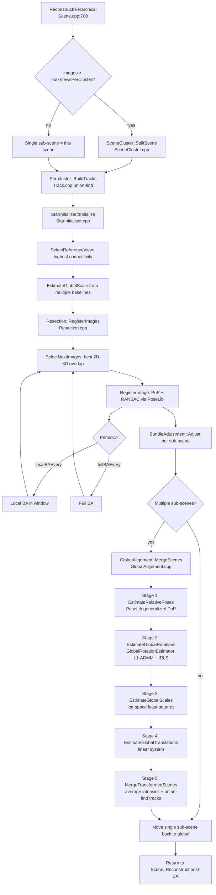
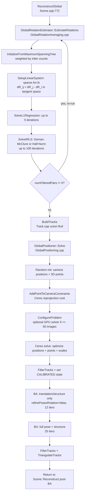
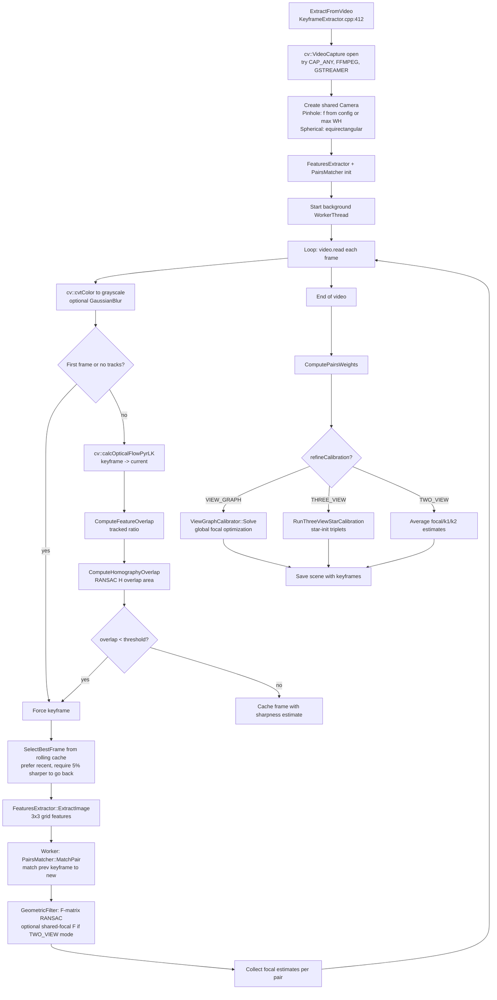
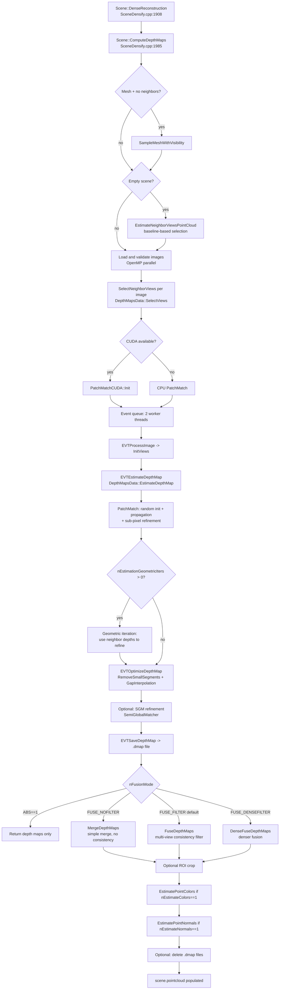
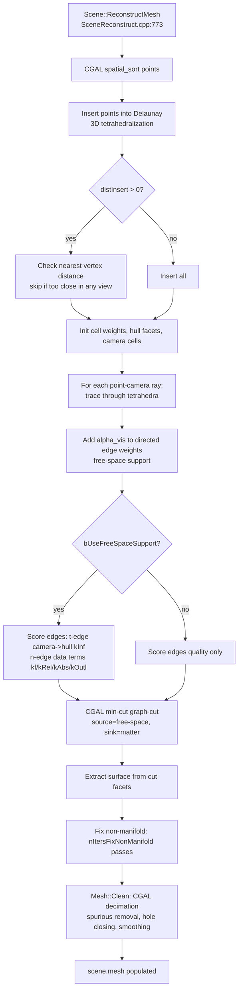
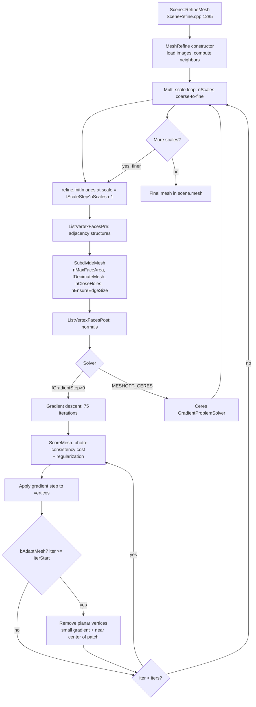

```mermaid
graph TD
    A[Scene::Reconstruct<br/>Scene.cpp:610] --> B[Scene::Import<br/>Scene.cpp:191]
    B --> B1[Scan directory or split semicolon list]
    B1 --> B2[Load EXIF/metadata per image<br/>Image::LoadMetadata]
    B2 --> B3[Optional: ImportPosesCSV]
    B3 --> B4[Cluster identical cameras<br/>shared camera pointers]
    B4 --> C[Scene::ExtractFeatures<br/>Scene.cpp:420]
    C --> C1[FeaturesExtractor::Extract<br/>FeaturesExtractor.cpp]
    C1 --> C2{Detector Type}
    C2 -->|AKAZE| C3[cv::AKAZE 3x3 grid]
    C2 -->|ORB| C4[cv::ORB 3x3 grid]
    C2 -->|SIFT| C5[cv::SIFT -> RootSIFT conversion]
    C2 -->|SIFTGPU| C6[SiftGPU CUDA/OpenGL]
    C3 --> D
    C4 --> D
    C5 --> D
    C6 --> D
    D[Scene::MatchPairs<br/>Scene.cpp:442] --> D1[PairsMatcher::Match<br/>PairsMatcher.cpp]
    D1 --> D2{Match Mode}
    D2 -->|VOCABULARY| D3[VocabularyTree query<br/>top-K pairs]
    D2 -->|EXHAUSTIVE| D4[All N^2 pairs]
    D2 -->|SEQUENTIAL| D5[Consecutive overlap window]
    D3 --> D6[PairsMatcher::MatchPair]
    D4 --> D6
    D5 --> D6
    D6 --> D7[MatchFeatures: FLANN/BFMatcher<br/>Lowe ratio test]
    D7 --> D8[GeometricFilter: RANSAC<br/>Essential or Fundamental matrix]
    D8 --> D9[Optional: PairsWeighting<br/>spatial * connectivity * triplet]
    D9 --> E[ViewGraphCalibrator::Solve<br/>ViewGraphCalibrator.cpp]
    E --> E1[Fetzer focal length estimation<br/>Ceres global optimization]
    E1 --> E2[ComputeRelativePoses with updated cameras]
    E2 --> F[Save scene_pre_reconstruction.sfm]
    F --> G{Solver Mode}
    G -->|default| H[Scene::ReconstructHierarchical]
    G -->|useGlobalSolver| I[Scene::ReconstructGlobal]
    H --> J
    I --> J
    J[Pre-final BA: BundleAdjustment::Adjust<br/>+ FilterTracks + TriangulateTracks] --> K[Final BA: BundleAdjustment::Adjust]
    K --> L[FilterWeaklyConnectedImages]
    L --> M{Uncalibrated images?}
    M -->|yes| N[Resection::RegisterImages]
    M -->|no| O
    N --> O
    O{GPS available?} -->|yes| P[Scene::AlignToGPS]
    O -->|no| Q
    P --> Q{extractColors?}
    Q -->|yes| R[Scene::SampleColors]
    Q -->|no| S[Save .sfm output]
    R --> S
```

# OpenMVS Pipeline Documentation

> Auto-generated by codebase analysis. Last updated: 2026-03-24

This document traces every major data-flow pipeline in the OpenMVS SFM/MVS codebase. All function references correspond to real source code locations.

---

## Table of Contents

1. [SFM Incremental Pipeline](#1-sfm-incremental-pipeline)
2. [SFM Hierarchical Pipeline](#2-sfm-hierarchical-pipeline)
3. [SFM Global Pipeline](#3-sfm-global-pipeline)
4. [Keyframe Extraction Pipeline](#4-keyframe-extraction-pipeline)
5. [MVS Dense Reconstruction Pipeline](#5-mvs-dense-reconstruction-pipeline)
6. [MVS Mesh Reconstruction Pipeline](#6-mvs-mesh-reconstruction-pipeline)
7. [MVS Mesh Refinement Pipeline](#7-mvs-mesh-refinement-pipeline)
8. [MVS Texture Mapping Pipeline](#8-mvs-texture-mapping-pipeline)
9. [MVS Quality Assessment](#9-mvs-quality-assessment)
10. [Import/Export Pipelines](#10-importexport-pipelines)
11. [Key Data Structures Cross-Reference](#key-data-structures-cross-reference)
12. [Algorithm Choices and Build Flags](#algorithm-choices-and-build-flags)
13. [Relevant Source Files](#relevant-source-files)

---

## 1. SFM Incremental Pipeline

### Entry Point

`SFM::Scene::Reconstruct()` — `libs/SFM/Scene.cpp:610`

Called from: `CreateStructure` app (`apps/CreateStructure/CreateStructure.cpp:263`)

### Flow Diagram



### Step-by-Step Narrative

**Step 1: Image Import**

- Function: `Scene::Import()` — `libs/SFM/Scene.cpp:191`
- Input: folder path or semicolon-separated image list
- Processing: scans directory for jpg/png/tif/jxl/exr/webp; sorts numerically; loads each image metadata (EXIF, GPS, focal length estimate via `Image::LoadMetadata`); clusters images sharing identical camera parameters into shared `Camera` pointers
- Output: `scene.images[]` populated with file paths, metadata, and `pCamera` pointers; `scene.cameras[]` unique camera list
- Config: `ImportConfig::defaultFocalRatio` (1.2), `ImportConfig::useExif`, `ImportConfig::importPosesCSV`, `ImportConfig::focalLength`/`k1`/`k2` overrides

**Step 2: Feature Extraction**

- Function: `Scene::ExtractFeatures()` → `FeaturesExtractor::Extract()` — `libs/SFM/Scene.cpp:420`, `libs/SFM/FeaturesExtractor.cpp`
- Input: `scene.images[]` with file paths; `FeatureExtractionConfig`
- Processing: for each image, creates a 3×3 spatial grid; runs detector on each cell up to `maxFeaturesPerCell` (default 3000, giving max 27000 features/image); binary descriptors (AKAZE/ORB) stored as CV_8U; SIFT converted to RootSIFT (L1-normalize then sqrt, quantized to uint8); optional OpenMVG import/export
- Output: `image.keypoints` (cv::KeyPoint), `image.descriptors` (CV_8U)
- Config: `FeatureExtractionConfig::detectorType`, `maxFeaturesPerCell`, `minFeaturesPerCell`, `releaseImagePixels`
- Parallelism: OpenMP parallel for over images when `SCENE_USE_OPENMP` enabled

**Step 3: Pair Matching**

- Function: `Scene::MatchPairs()` → `PairsMatcher::Match()` — `libs/SFM/Scene.cpp:442`, `libs/SFM/PairsMatcher.cpp`
- Input: extracted features per image; `MatchConfig`
- Processing:
  - VOCABULARY mode: builds VocabularyTree on descriptors, queries top `maxPairsPerImage` (50) candidates per image, optionally expands via `expandPairsTopK` co-neighbor images
  - EXHAUSTIVE mode: all O(N²) pairs
  - SEQUENTIAL mode: matches each image to `matchSequenceOverlap` subsequent images
  - Optional pre-match threshold filter
  - Per pair: `MatchFeatures()` uses FLANN (LSH for binary, KDTree for float) with Lowe ratio test (0.9 AKAZE/ORB, 0.8 SIFT) and optional cross-check
  - `GeometricFilter()`: RANSAC for E-matrix (calibrated pairs) or F-matrix (uncalibrated); min 50 inlier matches; optional H estimation
  - `PairsWeighting`: computes composite weight = spatial × connectivity × triplet for each pair
- Output: `scene.pairs[]` with inlier matches, E/F/H matrices, relative poses, weights
- Config: `MatchConfig::mode`, `maxPairsPerImage`, `matchDistance`, `matchRatio`, `maxEpipolarError`, `minMatches`
- Parallelism: `BS::light_thread_pool` for parallel pair matching; per-thread matcher instances

**Step 4: View Graph Calibration (optional)**

- Function: `ViewGraphCalibrator::Solve()` — `libs/SFM/ViewGraphCalibrator.cpp`
- Input: `scene.cameras[]`, `scene.pairs[]` with F-matrices
- Processing: global Ceres optimization of focal lengths using Fetzer focal length estimation method across all image pairs; filters pairs with high residuals; updates untrusted cameras only (`trustIntrinsics=false`)
- Output: refined `camera.fx/fy` for non-trusted cameras; `ComputeRelativePoses()` rerun for updated cameras
- Config: `ViewGraphCalibratorConfig::minFocalRatio`, `maxFocalRatio`, `trustIntrinsics`, `maxTwoViewError`, `minPairWeight`, `lossThreshold`, `maxIterations`

**Step 5: Dispatch to Hierarchical or Global**

- Function: `Scene::Reconstruct()` — `libs/SFM/Scene.cpp:656`
- Input: matched scene with relative poses; `ReconstructionConfig::useGlobalSolver`
- Processing: saves intermediate `scene_pre_reconstruction.sfm`; branches to `ReconstructHierarchical()` (default) or `ReconstructGlobal()`

**Step 6: Post-reconstruction Refinement (shared)**

- Function: `Scene::Reconstruct()` — `libs/SFM/Scene.cpp:659–697`
- Processing: two-phase global BA (pre-final at 25 iters, final at config iters); `FilterTracks()`; `TriangulateTracks()`; `FilterWeaklyConnectedImages()`; optional final `Resection::RegisterImages()` for remaining unregistered images; optional `AlignToGPS()`; optional `SampleColors()`

### Data Flow Summary

| Stage | Input | Output | Key Config |
|-------|-------|--------|------------|
| Image Import | Folder/file list | `scene.images`, `scene.cameras` | `defaultFocalRatio`, `focalLength` |
| Feature Extraction | Image files | `image.keypoints`, `image.descriptors` | `detectorType`, `maxFeaturesPerCell` |
| Pair Matching | Descriptors | `scene.pairs[]` with E/F/H + relative poses | `mode`, `maxPairsPerImage`, `matchRatio` |
| View Graph Calib. | F-matrices | Refined focal lengths | `trustIntrinsics`, `lossThreshold` |
| Track Building | Image pair matches | `scene.tracks[]` observations | `minPairWeight` |
| Star Init. | Relative poses | Initial camera poses | `minViews`, `maxViews` |
| Resection | 2D-3D correspondences | Registered camera poses | `minCorrespondences`, `ransac.threshold` |
| Bundle Adjustment | Poses + tracks | Refined poses + 3D points | `maxIterations`, `baIntrinsicFlags` |
| GPS Alignment | Camera centers + GPS | Similarity transform | `thAlignGPS` |

---

## 2. SFM Hierarchical Pipeline

### Entry Point

`SFM::Scene::ReconstructHierarchical()` — `libs/SFM/Scene.cpp:700`

Called from `Scene::Reconstruct()` when `useGlobalSolver=false` (default).

### Flow Diagram



### Step-by-Step Narrative

**Step 1: Scene Clustering**

- Function: `SceneCluster::SplitScene()` — `libs/SFM/SceneCluster.cpp`
- Input: full `scene.images`, `scene.pairs`
- Processing: aggregative bottom-up clustering on covisibility graph; merges highest-weight edges until clusters ≤ `maxViewsPerCluster` (200); `maxOverCapacity` (20) allows absorbing orphan views; splits disconnected components; keypoints/descriptors MOVED (not copied) to sub-scenes
- Output: `std::vector<Scene> subScenes`, `std::vector<IIndexArr> localToGlobals`
- Config: `ClusterConfig::maxViewsPerCluster`, `maxOverCapacity`

**Step 2: Per-cluster Track Building**

- Function: `BuildTracks()` — `libs/SFM/Track.cpp`
- Input: `scene.pairs[]` matches (per sub-scene)
- Processing: union-find over `(imageID, featureID)` pairs; merges observations connected through match chains; discards tracks with < 2 observations; duplicate-image guard
- Output: `scene.tracks[]` with `Observation[]` arrays
- Config: `minPairWeight` (3.0, pairs with lower weight ignored)
- Parallelism: per sub-scene runs in `BS::light_thread_pool::detach_loop`

**Step 3: Star Initialization**

- Function: `StarInitializer::Initialize()` — `libs/SFM/StarInitializer.cpp`
- Input: sub-scene with relative poses in `scene.pairs`
- Processing: `SelectReferenceView()` picks image with most connections; forms star configuration with `minViews`–`maxViews` (4–36) connected images; sets absolute poses from relative poses via chain; `EstimateGlobalScale()` from multiple baseline ratios; triangulates initial tracks
- Output: initial absolute camera poses in `image.R`, `image.C`
- Config: `StarInitConfig::minViews`, `maxViews`, `minTracksPerView`, `maxReprojError`

**Step 4: Incremental Resection**

- Function: `Resection::RegisterImages()` — `libs/SFM/Resection.cpp`
- Input: sub-scene with some initialized poses and tracks
- Processing: iterates selecting next best image by 2D-3D overlap score; `RegisterImage()` runs PnP via PoseLib + RANSAC with `ransac.threshold` (4px); new tracks triangulated; local BA every `localBAEvery` (10) images in window of `maxLocalWindow` (25); full BA every `fullBAEvery` (25, 50, 100)
- Output: fully calibrated camera poses for all connected images
- Config: `ResectionConfig::minCorrespondences`, `minInliers`, `localBAEvery`, `fullBAEvery`

**Step 5: Global Alignment Merge (5 stages)**

- Function: `GlobalAlignment::MergeScenes()` — `libs/SFM/GlobalAlignment.cpp`
- Stage 1 — Relative Poses: `EstimateRelativePoses()` uses PoseLib generalized absolute pose (multi-camera PnP) between sub-scene pairs sharing cross-cluster image pairs; min `minCommonTracks` (25) inliers
- Stage 2 — Rotation Averaging: `EstimateGlobalRotations()` → `GlobalRotationEstimator`; MST init (weighted by inliers); L1-ADMM sparse linear system in tangent space; IRLS with Geman-McClure or Half-Norm loss
- Stage 3 — Scale Averaging: `EstimateGlobalScales()` → `GlobalScaleEstimator`; log-space least-squares: `log(s_j) - log(s_i) = log(s_ij)`; gauge fix: first sub-scene scale = 1.0
- Stage 4 — Translation Averaging: `EstimateGlobalTranslations()` → `GlobalTranslationEstimator`; linear system `t_j - t_i = t_ij` given fixed rotations and scales
- Stage 5 — Merge: `MergeTransformedScenes()` applies similarity transforms; averages shared camera intrinsics via `Camera::AccumulateIntrinsics()`/`ScaleIntrinsics()`; moves keypoints/descriptors back; `MergeTracksWithCrossSubScenePairs()` union-find with 3D proximity guard
- Output: merged global scene with all poses and tracks in one coordinate frame

---

## 3. SFM Global Pipeline

### Entry Point

`SFM::Scene::ReconstructGlobal()` — `libs/SFM/Scene.cpp:772`

### Flow Diagram



### Step-by-Step Narrative

**Step 1: Global Rotation Averaging**

- Function: `GlobalRotationEstimator::EstimateRotations()` — `libs/SFM/GlobalRotationAveraging.cpp`
- Input: `scene.pairs[]` with relative rotations; scene images
- Processing: MST spanning tree initialization weighted by match counts; sparse linear system `dR_ij = dR_j - dR_i` in angle-axis tangent space; L1-ADMM for up to 5 iterations; IRLS refinement with Geman-McClure loss (sigma=5 degrees); optional second pass after filtering inconsistent pairs
- Output: `image.R` set for all connected images; gauge freedom fixed by first node
- Config: `GlobalRotationEstimatorOptions::maxNumL1Iterations`, `maxNumIrlsIterations`, `weightType`, `maxRelativeRotationAngle` (12 degrees)

**Step 2: Track Building**

- Same as described in hierarchical pipeline, `BuildTracks()` — `libs/SFM/Track.cpp`

**Step 3: Global Positioning**

- Function: `GlobalPositioner::Solve()` — `libs/SFM/GlobalPositioning.cpp`
- Input: scene with known rotations, tracks, `GlobalPositionerOptions`
- Processing: random initialization of camera centers and 3D point positions; Ceres problem with `ONLY_POINTS` constraint type (reprojection residuals); optional per-image scale variables; GPU solver (GLOMAP-style) when `images >= 50` and CUDA available
- Output: `image.C` (camera centers), `track.position` (3D points)
- Config: `constraintType` (ONLY_POINTS), `generateRandomPositions`, `maxNumIterations` (200), `minNumViewPerTrack` (3), `useGpu`

**Step 4: Bundle Adjustment (2 passes)**

- First pass: `BundleAdjustment::Adjust()` with `refinePosesRotation=false`, 12 iterations — refines translations and structure only
- Second pass: full BA, 25 iterations — refines full poses + structure + intrinsics per `baIntrinsicFlags`

---

## 4. Keyframe Extraction Pipeline

### Entry Point

`SFM::KeyframeExtractor::ExtractFromVideo()` — `libs/SFM/KeyframeExtractor.cpp:412`

Called from: `ExtractKeyframes` app (`apps/ExtractKeyframes/ExtractKeyframes.cpp:255`)

### Flow Diagram



### Step-by-Step Narrative

**Step 1: Video Decode and Camera Init**

- Opens video via OpenCV (tries CAP_ANY/FFMPEG/GStreamer backends)
- Creates single shared `PinholeCamera` (or `SphericalCamera`) for all frames
- Focal length: user-provided `config.focalLength` or `max(width, height)` fallback

**Step 2: Per-frame Tracking and Selection**

- `cv::calcOpticalFlowPyrLK`: pyramidal Lucas-Kanade tracking (21×21 window, 3 pyramid levels, 30 max iters)
- `ComputeFeatureOverlap()`: counts tracked points still in bounds
- `ComputeHomographyOverlap()`: RANSAC homography, warps corners to measure area overlap
- Keyframe selected when either overlap ratio < `overlapThreshold` (0.85)
- Rolling frame cache (size 5) selects sharpest frame (Laplacian variance), preferring recent if within 5% sharpness

**Step 3: Feature Extraction (per keyframe)**

- `FeaturesExtractor::ExtractImage()` with 3×3 grid, up to `maxFeaturesPerCell` features
- Executed in main thread (detector shared via pointer); saving/matching offloaded to background worker thread

**Step 4: Pair Matching (background worker)**

- Consecutive keyframe pairs matched via `PairsMatcher::MatchPair()`
- F-matrix RANSAC; if `TWO_VIEW` calibration mode: `forceFundamentalWithFocal=true` for shared-focal estimation
- Focal/k1/k2 estimates accumulated per pair

**Step 5: Calibration Refinement**

- VIEW_GRAPH (default): `ViewGraphCalibrator::Solve()` — global Ceres optimization of focal lengths
- THREE_VIEW: `RunThreeViewStarCalibration()` — star-init + BA on subsampled triplets
- TWO_VIEW: median of per-pair fundamental-matrix focal estimates
- Updates `PinholeCamera::fx/fy/k1/k2`; marks `trustIntrinsics = true`

### Data Flow Summary

| Stage | Input | Output |
|-------|-------|--------|
| Video Decode | Video file | BGR frames at native resolution |
| Optical Flow | Keyframe gray + current gray | Tracked point positions + status |
| Overlap Estimation | Tracked points | overlapRatio, overlapArea |
| Feature Extraction | Selected keyframe | Keypoints + descriptors |
| Pair Matching | Consecutive keyframe descriptors | ImagePair with F-matrix |
| Calibration Refine | F-matrices for all pairs | Refined PinholeCamera intrinsics |

---

## 5. MVS Dense Reconstruction Pipeline

### Entry Point

`MVS::Scene::DenseReconstruction()` — `libs/MVS/SceneDensify.cpp:1908`

Called from: `DensifyPointCloud` app (`apps/DensifyPointCloud/DensifyPointCloud.cpp`)

### Flow Diagram



### Step-by-Step Narrative

**Step 1: View Selection**

- Function: `DepthMapsData::SelectViews()` — `libs/MVS/SceneDensify.cpp:150`
- Input: `scene.images`, `scene.pointcloud` for geometric scoring
- Processing: for each reference image, scores candidate neighbor views by viewing angle, scale ratio, and number of shared visible points; filters by `FilterNeighborViews()` (min area 0.1, scale 0.2–2.4, angle 3–45 degrees); keeps up to 12 neighbors
- Output: `DepthData::images[]` — reference image + sorted neighbors

**Step 2: Depth Map Estimation**

- Function: `DepthMapsData::EstimateDepthMap()` — `libs/MVS/SceneDensify.cpp`
- Input: `DepthData` with reference + neighbor images
- Processing:
  - CPU: `DepthEstimator` iterates pixels in zigzag scan order; for each pixel: random depth/normal initialization; propagation from neighbors; NCC/ZNCC photo-consistency score; sub-pixel refinement
  - CUDA: `PatchMatchCUDA` runs GPU-parallel random init + checkerboard propagation
  - `InitDepthMap()`: projects sparse point cloud to initialize depth from SFM points
  - `nEstimationGeometricIters` (default 1): geometry-consistent iteration uses neighbor depth maps to constrain
- Output: `DepthData::depthMap`, `normalMap`, `confMap`
- Config: `OPTDENSE::nResolutionLevel`, `nMinResolution`, `OPTDENSE::nEstimationGeometricIters`
- Parallelism: 2 worker threads via event queue; CUDA GPU when available

**Step 3: Depth Map Filtering**

- `RemoveSmallSegments()`: removes isolated depth regions
- `GapInterpolation()`: fills small holes in depth maps
- `EVTFilterDepthMap`/`EVTAdjustDepthMap`: `AdjustConfidence()` multi-view consistency check — compares each depth to projections from neighbors; marks inconsistent depths

**Step 4: Depth Map Fusion**

- `FuseDepthMaps()` (default): for each pixel, projects through all neighbor depth maps; keeps points visible and consistent in at least 2 views; ZNCC confidence-weighted averaging
- `MergeDepthMaps()`: simpler merge without cross-view consistency
- `DenseFuseDepthMaps()`: denser variant
- Output: `scene.pointcloud` with positions, optional colors/normals, and `pointViews` (which images see each point)

### Data Flow Summary

| Stage | Input | Output | Parallelism |
|-------|-------|--------|-------------|
| View Selection | Pointcloud + cameras | DepthData view lists | OpenMP |
| InitViews | DepthData | Warped neighbor images at ref scale | Single thread |
| Depth Estimation | Warped images | DepthMap + NormalMap + ConfMap | CUDA GPU or 2 CPU threads |
| Geometric Refine | Depth maps from neighbors | Improved depth maps | Same threads |
| Fusion | All depth maps | Dense point cloud | Single thread |

---

## 6. MVS Mesh Reconstruction Pipeline

### Entry Point

`MVS::Scene::ReconstructMesh()` — `libs/MVS/SceneReconstruct.cpp:773`

Called from: `ReconstructMesh` app (`apps/ReconstructMesh/ReconstructMesh.cpp`)

### Flow Diagram



### Step-by-Step Narrative

**Step 1: Delaunay Tetrahedralization**

- Uses CGAL `Delaunay_triangulation_3` with spatial sort for cache-friendly insertion
- `distInsert` (default 2 pixels): point skipped if it projects within this distance of an already-inserted point in any of its views — avoids redundant tetrahedra
- Stores per-vertex view information (`InsertViews()`)
- `kSigma` (2): controls sigma for Gaussian weighting of edge distances

**Step 2: Free-Space Graph Scoring**

- For each point-camera ray, marches through tetrahedra using CGAL `locate()` chain
- Adds `alpha_vis` (visibility confidence) to directed edges separating free-space cells from matter cells
- Camera cells linked to source with weight `kInf`; hull facets represent surface candidates
- Edge weights: `kf` (quality), `kRel`/`kAbs` (relative/absolute outlier penalties), `kQual` (quality score)

**Step 3: Graph-Cut**

- CGAL Alpha-shape min-cut solver separates free-space (source) from matter (sink) tetrahedra
- Cut facets form the extracted surface triangles
- `nItersFixNonManifold` (4): iterative passes to fix non-manifold vertices/edges

**Step 4: Mesh Cleaning**

- `Mesh::Clean()` — `libs/MVS/Mesh.cpp`
- CGAL-based: decimation (`fDecimate`), spurious component removal (`fSpurious`), spike removal (`bRemoveSpikes`), hole closing (`nCloseHoles`), Laplacian smoothing (`nSmoothMesh`), edge-length enforcement (`fEdgeLength`)

---

## 7. MVS Mesh Refinement Pipeline

### Entry Points

- `MVS::Scene::RefineMesh()` — `libs/MVS/SceneRefine.cpp:1285`
- `MVS::Scene::RefineMeshCUDA()` — `libs/MVS/SceneRefineCUDA.cpp` (CUDA build only)

Called from: `RefineMesh` app (`apps/RefineMesh/RefineMesh.cpp`)

### Flow Diagram



### Step-by-Step Narrative

**Multi-resolution structure**

- `nScales` (3) coarse-to-fine levels; scale factor `fScaleStep` (0.5) per level
- Coarsest scale: images at `fScaleStep^(nScales-1)` resolution; allows large moves
- Finest scale: full resolution; fine detail recovery

**Subdivision (`SubdivideMesh()`)**

- `nMaxFaceArea`: subdivides faces larger than threshold
- `fDecimateMesh`: decimates at first scale only
- `nCloseHoles`: closes open boundaries
- `nEnsureEdgeSize`: ensures edges within min/max length bounds

**Photo-consistency scoring (`ScoreMesh()`)**

- Projects each face into all views that can see it (based on normal)
- Computes ZNCC (zero-normalized cross-correlation) photometric error between rendered patches
- Regularization term weighted by `fRegularityWeight`: penalizes deviation from smooth surface
- `fRatioRigidityElasticity`: ratio between rigid and elastic deformation energy (high in early iters, 1.0 near end)
- `nAlternatePair`: alternate between using one or both views per pair

**Vertex update**

- `grad * gstep` applied to each vertex position; `gstep = 0.4` (or from `fGradientStep`)
- `fThPlanarVertex`: removes nearly-planar low-gradient vertices after `iterStart` = 40% of total iters

**CUDA variant (`RefineMeshCUDA`)**

- Same algorithm but GPU-parallelized projection and gradient computation
- Requires `_USE_CUDA` compile flag

---

## 8. MVS Texture Mapping Pipeline

### Entry Point

`MVS::Scene::TextureMesh()` — `libs/MVS/SceneTexture.cpp:2405`

Called from: `TextureMesh` app (`apps/TextureMesh/TextureMesh.cpp`)

### Flow Diagram

```mermaid
graph TD
    A[Scene::TextureMesh<br/>SceneTexture.cpp:2405] --> B[MeshTexture constructor<br/>scale images to nResolutionLevel]
    B --> C[texture.FaceViewSelection<br/>SceneTexture.cpp]
    C --> C1[For each face: project to all images<br/>compute blending weight angle+resolution]
    C1 --> C2[MRF/graph optimization: assign best view per face]
    C2 --> C3[Spatial patch grouping:<br/>connected faces with same view = patch]
    C3 --> C4[Optional: virtual faces from minCommonCameras]
    C4 --> D[texture.GenerateTexture]
    D --> D1[AtlasPacker: skyline bin-packing<br/>optional rotation for better fit]
    D1 --> D2[Rasterize face UVs into atlas]
    D2 --> D3{bGlobalSeamLeveling?}
    D3 -->|yes| D4[Global seam leveling:<br/>solve linear system for mean color correction]
    D3 -->|no| D5
    D4 --> D5{bLocalSeamLeveling?}
    D5 -->|yes| D6[Local seam leveling:<br/>Poisson blending along patch boundaries]
    D5 -->|no| D7
    D6 --> D7[Optional: fSharpnessWeight unsharp mask]
    D7 --> D8[mesh.texturesDiffuse[] filled<br/>mesh.faceTexcoords[] set]
```

### Step-by-Step Narrative

**Step 1: Face-View Selection**

- `MeshTexture::FaceViewSelection()` — `libs/MVS/SceneTexture.cpp`
- Each face scored per visible image by: viewing angle (normal vs camera direction), resolution (projected face area vs image resolution)
- `fOutlierThreshold`: removes faces with insufficient image coverage
- `fRatioDataSmoothness` (0.3): MRF smoothness vs data weight for spatially coherent view assignment
- `nIgnoreMaskLabel`: excludes masked regions (lens distortion mask or user-specified label)
- Output: `texturePatches` — groups of faces sharing a view assignment

**Step 2: Atlas Packing**

- `AtlasPacker` — `libs/MVS/AtlasPacker.cpp`
- Skyline bin-packing algorithm with optional 90-degree rotation for better area utilization
- `nTextureSizeMultiple`: forces atlas dimensions to multiple of this value
- `maxTextureSize`: splits into multiple atlases if needed
- Output: UV coordinates `mesh.faceTexcoords[]`, atlas size

**Step 3: Global Seam Leveling**

- Solves linear system to equalize mean intensity across patches at seam boundaries
- Applies per-patch gain/bias correction to minimize visible color discontinuities
- `bGlobalSeamLeveling = true` by default

**Step 4: Local Seam Blending**

- Poisson blending along patch boundary strips
- `bLocalSeamLeveling = true` by default
- Produces smooth gradient transitions at atlas seams

**Step 5: Sharpness Enhancement**

- `fSharpnessWeight` (0.5): unsharp masking applied to final texture atlas
- `colEmpty`: fill color for untextured regions (default orange RGB 255,127,39)

---

## 9. MVS Quality Assessment

### Entry Point

`MVS::Scene::ComputeReconstructionQuality()` — `libs/MVS/SceneQuality.cpp:51`

### Flow Diagram

```mermaid
graph TD
    A[ComputeReconstructionQuality<br/>SceneQuality.cpp:51] --> B{mesh.HasTexture() and images?}
    B -->|no| C[Return empty quality]
    B -->|yes| D[For each calibrated image]
    D --> E[Render textured mesh from camera viewpoint<br/>rasterize mesh.faceTexcoords to off-screen buffer]
    E --> F[Load original photograph]
    F --> G[Compute completeness:<br/>fraction of pixels covered by mesh]
    G --> H[Compute SSIM in covered region]
    H --> I[Compute PSNR in covered region]
    I --> J[ImageScore: completeness * SSIM]
    J --> K[Aggregate: mean completeness, SSIM, PSNR]
    K --> L[Return ReconstructionQuality:<br/>score = 100 * completeness * SSIM]
```

### Scoring Metrics

- `completeness`: fraction of image pixels where mesh projects (0–1)
- `ssim`: SSIM of rendered vs original in covered region (0–1)
- `psnr`: PSNR in dB (diagnostic)
- `score()`: `100 × completeness × ssim` (composite 0–100)
- `nMaxResolution`: downscale images before comparison (0 = full resolution)

---

## 10. Import/Export Pipelines

### 10.1 COLMAP Import/Export

**App**: `InterfaceCOLMAP` — `apps/InterfaceCOLMAP/InterfaceCOLMAP.cpp`

**Import direction** (COLMAP to OpenMVS):

1. `ImportScene()` (line 722): reads `sparse/cameras.{txt,bin}` → `Interface::Platform/Camera` (PINHOLE model; pixel center shift -0.5)
2. Reads `sparse/images.{txt,bin}` → `Interface::Image` with `platformID`, `cameraID`, `poseID`, quaternion+translation pose
3. Reads `sparse/points3D.{txt,bin}` → `Interface::Vertex` (3D points with track observations)
4. Optionally reads `stereo/fusion.cfg` → dense depth map paths
5. Writes `.mvs` via `MVS::Scene::Save()`

**Export direction** (OpenMVS to COLMAP):

1. `ExportScene()` (line 1007): writes `sparse/cameras.{txt,bin}` (PINHOLE model; adds +0.5 pixel center)
2. Writes `sparse/images.{txt,bin}` (world-to-camera R, t)
3. Writes `sparse/points3D.{txt,bin}` with track observations
4. Optional: writes dense stereo configuration files

**Key conventions**:

- COLMAP pixel center at (0.5, 0.5); OpenMVS at (0, 0) → `cx -= 0.5`, `cy -= 0.5` on import
- Normalized intrinsics: optional `bNormalizeIntrinsics` flag
- Binary vs text: auto-detected on import; configurable on export

### 10.2 OpenMVG Import

**App**: `InterfaceOpenMVG` — `apps/InterfaceOpenMVG/InterfaceOpenMVG.cpp`

1. `ImportScene()` (line 106): reads OpenMVG SfM_Data binary format (`sfm_data.bin`)
2. Converts `Views` → `Interface::Image`, `Intrinsics` → `Interface::Platform::Camera`, `Extrinsics` → poses
3. Converts `Structure` (3D landmarks) → `Interface::Vertex` with track observations
4. Writes `.mvs` via `MVS::Interface` serialization

### 10.3 Metashape Import

**App**: `InterfaceMetashape` — `apps/InterfaceMetashape/InterfaceMetashape.cpp`

1. Reads Metashape XML project file (`.xml`)
2. Parses `<chunk>/<sensors>` → camera intrinsics; `<cameras>` → image poses; `<markers>` → optional GCPs; `<point_cloud>` or `<dense_cloud>` → 3D points
3. Converts coordinate system if reference frame specified
4. Writes `.mvs` via `MVS::Scene::Save()`

### 10.4 MVSNet Import

**App**: `InterfaceMVSNet` — `apps/InterfaceMVSNet/InterfaceMVSNet.cpp`

1. Reads MVSNet camera parameter files (`*.txt`) and image list
2. Constructs `MVS::Scene` with camera intrinsics and poses
3. Optional: reads per-image depth maps (`.pfm` format) into `DepthData`
4. Writes `.mvs` via `scene.Save()` (line 699)

### 10.5 Polycam Import

**App**: `InterfacePolycam` — `apps/InterfacePolycam/InterfacePolycam.cpp`

1. Reads Polycam export directory (JSON metadata + images)
2. Parses per-frame JSON camera parameters (intrinsics + ARKit poses)
3. Constructs `MVS::Scene` with one platform per session
4. Writes `.mvs` via `scene.Save()` (line 357)

### 10.6 CreateStructure (SFM Pipeline Entry Point)

**App**: `CreateStructure` — `apps/CreateStructure/CreateStructure.cpp`

1. Configures `ReconstructionConfig` from CLI options
2. Calls `SFM::Scene::Reconstruct(source, cfg)` — runs the full incremental/hierarchical/global SFM pipeline
3. Saves `.sfm` native format via `scene.Save()`
4. Optional: exports camera poses CSV, image pairs CSV
5. Optional: exports MVS format via `ExportMVS()` for downstream MVS processing (undistorts images, converts to `MVS::Interface` binary format)
6. Optional: generates depth maps from ROMA2 NPZ files via `ImportROMA2DepthMaps()`

---

## Key Data Structures Cross-Reference

### SFM::Scene (`libs/SFM/Scene.h`)

```
cameras: CameraPtrArr       — shared Camera objects (PinholeCamera / SphericalCamera)
images: ImageArr            — per-image: keypoints, descriptors, pose (R, C), metadata
pairs: ImagePairArr         — per-pair: matches, E/F/H matrices, relative pose, weights
tracks: TrackArr            — 3D points with Observation[] (imageID, featureID)
colors: Pixel8UArr          — per-track RGB (optional, from SampleColors())
transform: Matrix4x4        — GPS alignment transform (identity if not aligned)
status: Status              — state flags (FEATURES_EXTRACTED, MATCHED, CALIBRATED, GEO_ALIGN)
```

### MVS::Scene (`libs/MVS/Scene.h`)

```
platforms: PlatformArr      — camera rigs with mounted cameras and pose trajectories
images: ImageArr            — per-image: camera (K, R, C), pixels (lazy), neighbor views
pointcloud: PointCloud      — 3D points with pointViews, normals, colors, octree
mesh: Mesh                  — vertices, faces, normals, UV coords, texture atlases
obb: OBB3f                  — optional region-of-interest bounding box
transform: Matrix4x4        — coordinate system transform
```

### DepthData (`libs/MVS/DepthMap.h`)

```
images: ViewDataArr         — reference + neighbor warped images
depthMap: DepthMap          — per-pixel depth (float)
normalMap: NormalMap        — per-pixel surface normal
confMap: ConfidenceMap      — ZNCC confidence
dMin, dMax: float           — depth range from SFM sparse points
```

---

## Algorithm Choices and Build Flags

| Feature | Flag | Default | Effect |
|---------|------|---------|--------|
| CUDA PatchMatch | `_USE_CUDA` + `desiredDeviceID >= 0` | disabled | GPU depth estimation |
| CUDA Mesh Refine | `_USE_CUDA` | disabled | GPU gradient computation |
| Ceres BA | `_USE_CERES` | enabled | Non-linear optimization |
| SiftGPU | `_USE_SIFTGPU` | disabled | GPU SIFT feature extraction |
| OpenMP | `_USE_OPENMP` | enabled | Multi-threaded image loops |
| SGM refinement | `OPTDENSE::nEstimationGeometricIters > 0` | 1 | Geometry-consistent depth |
| Global vs Hierarchical | `ReconstructionConfig::useGlobalSolver` | false (hierarchical) | SFM solver selection |
| GPS Alignment | `ReconstructionConfig::thAlignGPS > 0` + GPS in EXIF | enabled | ENU coordinate frame |

---

## Relevant Source Files

| File | Role |
|------|------|
| `libs/SFM/Scene.cpp` | SFM pipeline orchestration |
| `libs/SFM/FeaturesExtractor.cpp` | Feature extraction |
| `libs/SFM/PairsMatcher.cpp` | Feature matching |
| `libs/SFM/VocabularyTree.cpp` | Image retrieval |
| `libs/SFM/MatchGeometric.cpp` | Geometric verification |
| `libs/SFM/Track.cpp` | Track building |
| `libs/SFM/StarInitializer.cpp` | Star initialization |
| `libs/SFM/Resection.cpp` | Incremental resection |
| `libs/SFM/BundleAdjustment.cpp` | Bundle adjustment |
| `libs/SFM/GlobalRotationAveraging.cpp` | Global rotation averaging |
| `libs/SFM/GlobalPositioning.cpp` | Global positioning |
| `libs/SFM/GlobalAlignment.cpp` | Multi-scene merge |
| `libs/SFM/SceneCluster.cpp` | Scene clustering |
| `libs/SFM/ViewGraphCalibrator.cpp` | Focal length estimation |
| `libs/SFM/KeyframeExtractor.cpp` | Video keyframe selection |
| `libs/MVS/SceneDensify.cpp` | Dense depth estimation |
| `libs/MVS/DepthMap.cpp` | CPU PatchMatch |
| `libs/MVS/PatchMatchCUDA.cu` | GPU PatchMatch |
| `libs/MVS/SemiGlobalMatcher.cpp` | SGM depth refinement |
| `libs/MVS/SceneReconstruct.cpp` | Mesh reconstruction |
| `libs/MVS/Mesh.cpp` | Mesh operations |
| `libs/MVS/SceneRefine.cpp` | CPU mesh refinement |
| `libs/MVS/SceneRefineCUDA.cu` | GPU mesh refinement |
| `libs/MVS/SceneTexture.cpp` | Texture mapping |
| `libs/MVS/AtlasPacker.cpp` | Atlas bin-packing |
| `libs/MVS/SceneQuality.cpp` | Quality metrics |

---

*Generated by automated codebase analysis — 2026-03-24*
